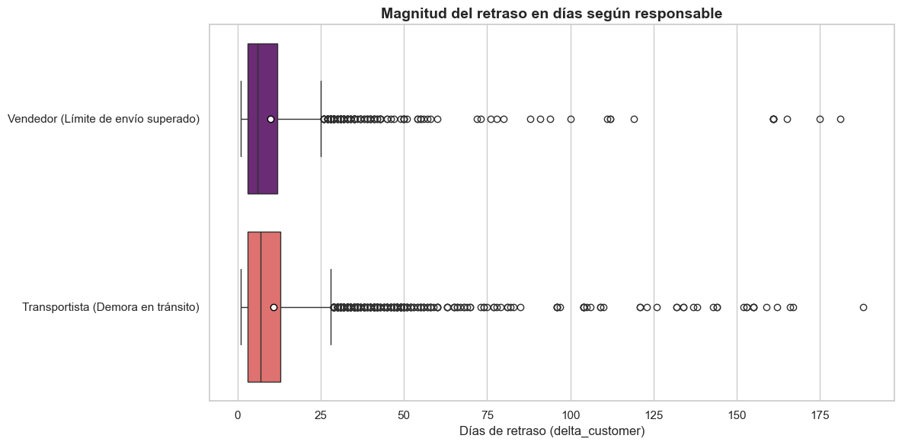

# 📊 E-commerce Performance: Olist Brazil 🇧🇷
### Proyecto Final de Máster en Data Analytics

Este repositorio contiene un análisis integral de la performance operativa y financiera de **Olist**, el mayor ecosistema de marketplaces en Brasil. A través de un enfoque basado en datos, se audita el flujo completo desde la captura de la orden hasta la entrega final, identificando ineficiencias que impactan directamente en el margen neto y la salud financiera de la compañía.

## 🎯 Objetivo del Proyecto
* **Describir y analizar la performance del flujo de ventas:** Evaluación de tiempos de entrega (*timing*), volumen de ventas completadas vs. canceladas e identificación de *bottlenecks* o anomalías operativas.
* **Generar un reporte de salud financiera:** Cuantificación de ingresos (GMV), costos logísticos y análisis de beneficios.
* **Determinar posibles insights de las ventas:** Identificación de estacionalidad, preferencias de financiación del usuario, comportamiento de los métodos de pago y segmentación regional.

## 📂 Estructura del Repositorio
* `/data` contiene los archivos en bruto: `customers.csv`, `orders.csv`, `order-items.csv`, `order-payments.csv`,  `order-reviews.csv` dentro de la subcarpeta `/raw` y los datasets finales procesados: `ecommerce-limpio.csv`, `ecommerce-for-dashboard.csv`, `eda-for-dashboard.csv` en la subcarpeta `/output`.
* `/notebooks`: Incluye los archivos de desarrollo modular:
    * `01-limpieza-transformacion.ipynb`: Proceso de ETL y preparación del dataframe unificado.
    * `02-eda.ipynb`: Exploración y desarrollo del análisis (EDA).
    * `03-ecommerce-eda.py`: EDA script en formato python. 
    * `04-pre-dashboard.ipynb`: Preparación de datos sintéticos para visualización en Power BI.
    * `05-dashboard-ecommerce.pbit`: Desarrollo del dashboard interactivo del proyecto en Power BI.
* `README.md`: Descripción del proyecto e Informe Analítico.

---

## 🛠️ Parte A: Ingeniería de Datos y Proceso ETL

La validez de las conclusiones estratégicas se sustenta en un proceso de ETL riguroso, transformando datos transaccionales en variables de decisión con una visión analítica.

### 1. Consolidación de Fuentes (Data Merging)
Se unificaron 5 datasets relacionales utilizando arquitecturas de *joins* basadas en `order_id` y `customer_id`. Este proceso permitió reconstruir la trazabilidad total de una compra: desde el perfil geográfico del cliente hasta la reseña final tras la entrega.

### 2. Feature Engineering y Transformaciones
Para elevar el nivel del análisis, se derivaron variables críticas:
* **Métricas de Valor Neto:** Creación de `valor_total` (suma de `price` + `freight_value`), permitiendo analizar la facturación real incluyendo el impacto logístico.
* **Métricas de Eficiencia Logística:** Cálculo del `delivery_delta` (promesa vs. realidad), una variable clave para medir la fiabilidad operativa y el cumplimiento de plazos.
* **Segmentación de Crédito:** Generación de `rango_cuotas`, agrupando transacciones para identificar patrones de consumo y capacidad de financiamiento del cliente brasileño.

### 3. Calidad de Datos e Imputación
* **Gestión de Nulos en Reseñas:** A pesar de presentar un 56% de nulos en los comentarios de texto, se decidió **preservar la variable**. El "silencio" o la falta de comentario es un dato en sí mismo; sin embargo, las reseñas existentes se utilizaron como el termómetro para medir el impacto de los errores de stock y de procesamiento de órdenes.
* **Limpieza Temporal:** Se imputaron y limpiaron registros en `order_approved_at` y `order_delivered_carrier_date` para evitar distorsiones en los cálculos de *Lead Time*.
* **Detección de Errores Técnicos:** Se implementó una lógica de banderas (`approval_status_flag`) para aislar órdenes canceladas por fallos de procesamiento, separándolas de las cancelaciones comerciales habituales.

---

## 📈 Parte B: Informe Analítico y Diagnóstico Estratégico

### 💰 Análisis de Ingresos y Mercado (GMV)
La facturación histórica analizada asciende a **$20.57 millones de reales**.
* **Hiper-concentración Regional:** El estado de **San Pablo (SP)** domina el 37.5% de la facturación global. El Sudeste (SP-RJ-MG-ES) concentra el **62.5% de los ingresos totales**, lo que define a la eficiencia logística en este eje como el principal driver de rentabilidad.
* **Perfil de Financiación:** El **63.2%** de las ventas se financia en planes cortos (1-4 cuotas), favoreciendo la liquidez. Se identificó un techo estructural en las 12 cuotas, donde el volumen cae al 0.2%, sugiriendo limitaciones de crédito para bienes de alto valor.

### 📉 Logística y Satisfacción
El análisis revela una correlación directa y destructiva entre el incumplimiento logístico y la experiencia del cliente:
* **Predictores de Detracción:** El retraso del transportista es el principal disparador de calificaciones de 1 estrella, con un promedio de 7 días de retrasos. El boxplot a continuación, representa la comparativa entre agentes responsables y magnitud de la ineficiencia logística.
  

* **Impacto en el Margen:** El uso de vouchers (descuentos) como estrategia de compensación ante estos fallos logra mitigar el daño reputacional a corto plazo, pero actúa como una carga financiera directa sobre el margen neto. Básicamente, la empresa está pagando por sus propios errores operativos.

### ⚠️ Auditoría de Fugas (Revenue Leakage)
Se cuantificaron dos puntos críticos de pérdida de capital:
* **Falta de Stock (Stockout):** Impacto negativo de **R$162,821.47**. Este valor representa ventas iniciadas pero no concretadas por falta de inventario.
* **Incidencias Técnicas:** 162 órdenes canceladas por errores de procesamiento. Aunque el volumen es bajo (0.17%), representan una ineficiencia operativa pura que erosiona el margen neto.

---

## 💡 Conclusión & Recomendación Estratégica
El ecosistema de Olist es financieramente saludable con un flujo de caja dinámico basado en pagos de corto plazo. Sin embargo, la rentabilidad máxima está limitada por ineficiencias operativas.

La recomendación estratégica se centra en la implementación de un **modelo de Fullfilment propio** en la región de San Pablo para capturar el margen perdido por stockouts y **mayor inverisón en desarrollo de la plataforma** que minimize errores técnicos, que en conjunto con la falta de stock rozan el 1% de las ventas. Esto permitiría reducir la emisión de vouchers compensatorios, transformando costos operativos en beneficios directos.

---

## 💻 Tecnologías Utilizadas
* **Python 3**
* **Pandas & NumPy**: Manipulación, limpieza y transformación de datos.
* **Matplotlib & Seaborn**: Visualización estadística y análisis de tendencias.
* **VS Code & Jupyter Notebook**: Entornos de desarrollo.
* **Power BI**: Visualización interactiva.

## 👨‍💻 Autor
**Rodrigo Antúnez** 
Economista | Data Analyst en formación @ThePower Business School

🔗 [GitHub Profile](https://github.com/rgoantunez)  
🔗 [Repositorio del Proyecto](https://github.com/rgoantunez/ecommerce-eda)

---
